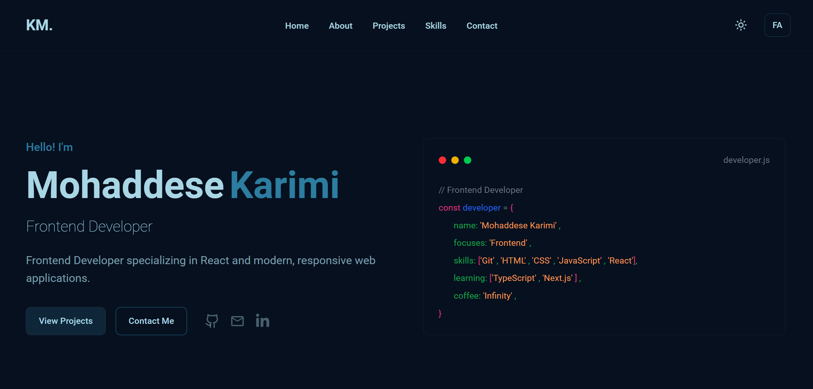

# Mohaddese Karimi — Portfolio

A personal portfolio website built to showcase my projects, skills, and experience as a Frontend Developer.

The portfolio is designed with a focus on clean UI, responsive layouts, reusable React components, and a bilingual experience in English and Persian.

## 🌐 Live Demo

**[View Portfolio](https://mohaddese-karimi.vercel.app/)**

## 📸 Preview



## ✨ Features

* 🌍 English and Persian language support
* 🔄 RTL support for Persian
* 🌓 Dark and Light mode
* 📱 Fully responsive design
* 🎨 Custom color theme and typography
* ✨ Smooth animations and scroll reveal effects
* 🧩 Reusable and modular React components
* 💼 Projects showcase
* 🛠️ Skills section with categorized technologies
* 📄 Resume download
* 📬 Contact and social links

## 🛠️ Tech Stack

### Frontend

* React
* TypeScript
* Tailwind CSS
* Vite

### Libraries & Tools

* Motion
* React Icons
* Lucide React
* Git
* GitHub
* Vercel

## 📁 Project Structure

```text
src/
├── components/
│   ├── About.tsx
│   ├── Contact.tsx
│   ├── Footer.tsx
│   ├── Hero.tsx
│   ├── Navbar.tsx
│   ├── ProjectCard.tsx
│   ├── Projects.tsx
│   ├── ScrollReveal.tsx
│   ├── Skills.tsx
│   └── SkillsCard.tsx
│
├── locals/
│   ├── en.ts
│   ├── fa.ts
│   └── index.ts
│
├── App.tsx
├── main.tsx
└── index.css
```

## 🚀 Getting Started

To run the project locally, follow these steps.

### 1. Clone the repository

```bash
git clone https://github.com/mohaddesekm/portfolio.git
```

### 2. Navigate to the project directory

```bash
cd portfolio
```

### 3. Install dependencies

```bash
pnpm install
```

### 4. Start the development server

```bash
pnpm dev
```

The application will be available at the local development URL provided by Vite.

## 📜 Available Scripts

| Command        | Description                       |
| -------------- | --------------------------------- |
| `pnpm dev`     | Starts the development server     |
| `pnpm build`   | Builds the project for production |
| `pnpm preview` | Previews the production build     |
| `pnpm lint`    | Runs ESLint                       |

## 🌍 Internationalization

The portfolio supports two languages:

* **English** — default language
* **Persian** — with RTL support

Translations are separated into dedicated files to keep the content organized and make adding additional languages easier in the future.

## 🎨 Design

The portfolio uses a custom color palette and typography system to maintain a consistent visual identity throughout the application.

### Fonts

* **Roboto** — English
* **Vazirmatn** — Persian

### Color Palette

```text
#040D12
#183D3D
#5C8374
#93B1A6
```

## 📱 Responsive Design

The layout is designed to work across different screen sizes, including:

* Desktop
* Laptop
* Tablet
* Mobile

Responsive Tailwind CSS utilities are used throughout the application to adapt layouts and spacing across breakpoints.

## 📂 Sections

The portfolio currently includes:

* **Home** — Introduction and primary call-to-action
* **About** — Background and personal information
* **Projects** — Selected projects and technologies used
* **Skills** — Technologies and development skills
* **Contact** — Contact information and social links

## 🚀 Deployment

The project is deployed using **Vercel**.

Every production update can be deployed directly from the GitHub repository through Vercel's deployment workflow.

## 📚 Purpose

This project was created not only as a personal portfolio, but also as a practical project for improving my skills in:

* React
* TypeScript
* Tailwind CSS
* Component-based architecture
* Responsive web development
* Git and GitHub workflows
* Frontend UI/UX
* Internationalization

## 📬 Contact

If you'd like to connect or discuss a project, feel free to reach out.

* **Portfolio:** [mohaddese-karimi.vercel.app](https://mohaddese-karimi.vercel.app/)
* **Email:** [mhaddese@gmail.com](mailto:mhaddese@gmail.com)
* **GitHub:** [github.com/mohaddesekm](https://github.com/mohaddesekm)
* **Telegram:** [@mohaddesekm](https://t.me/mohaddesekm)

## 📄 License

This project is personal and created for portfolio purposes.
